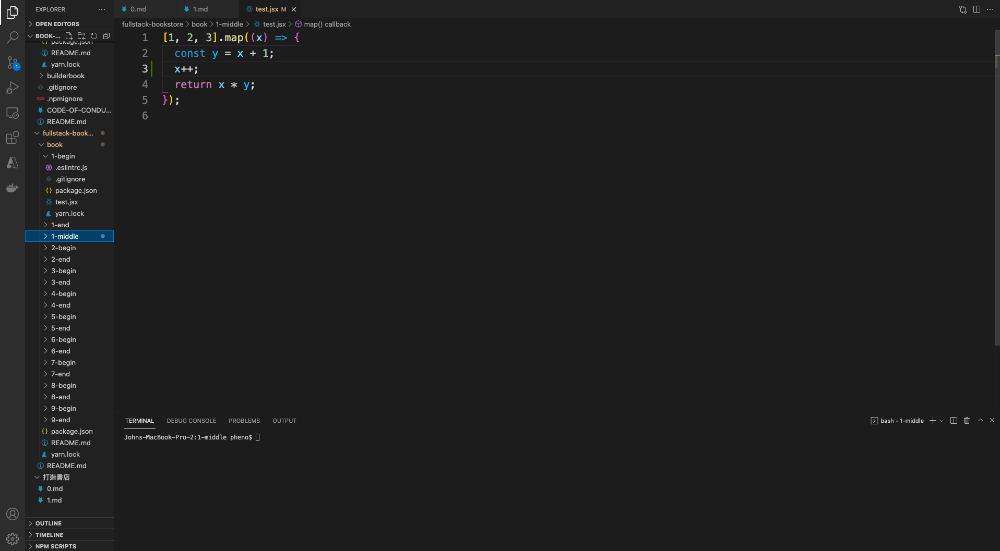
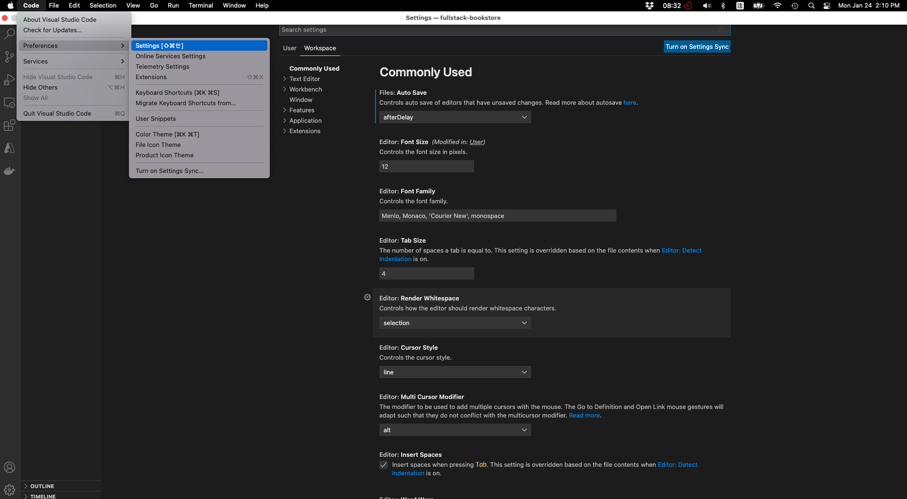
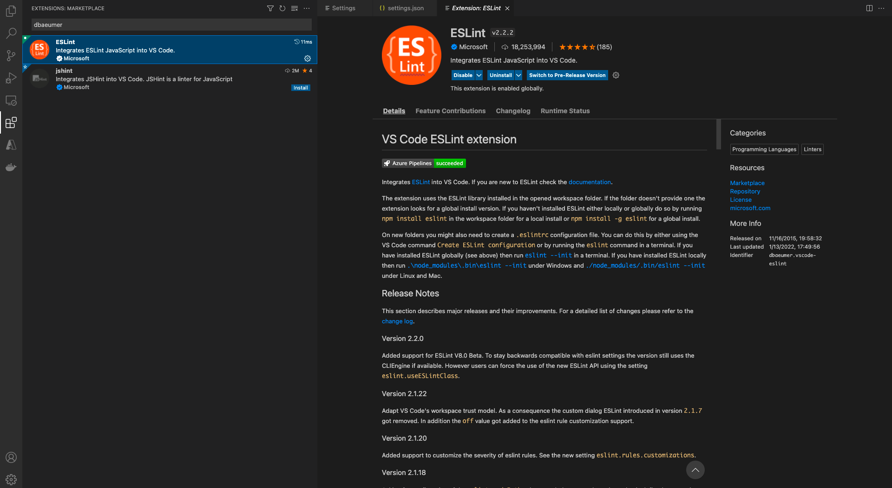
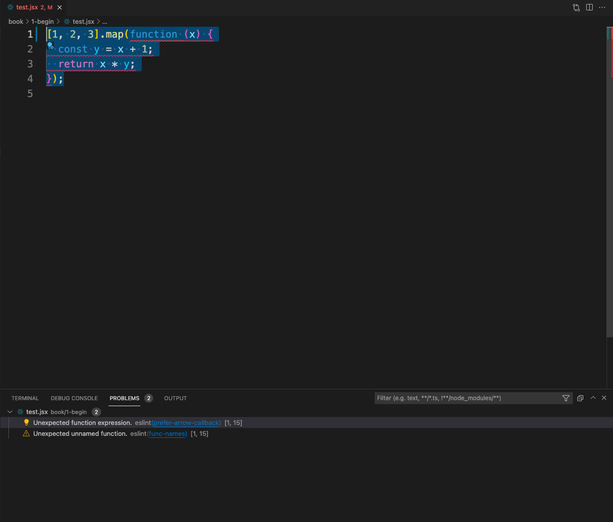
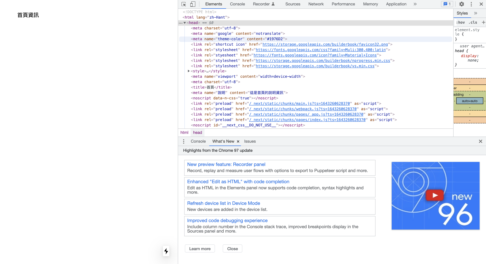
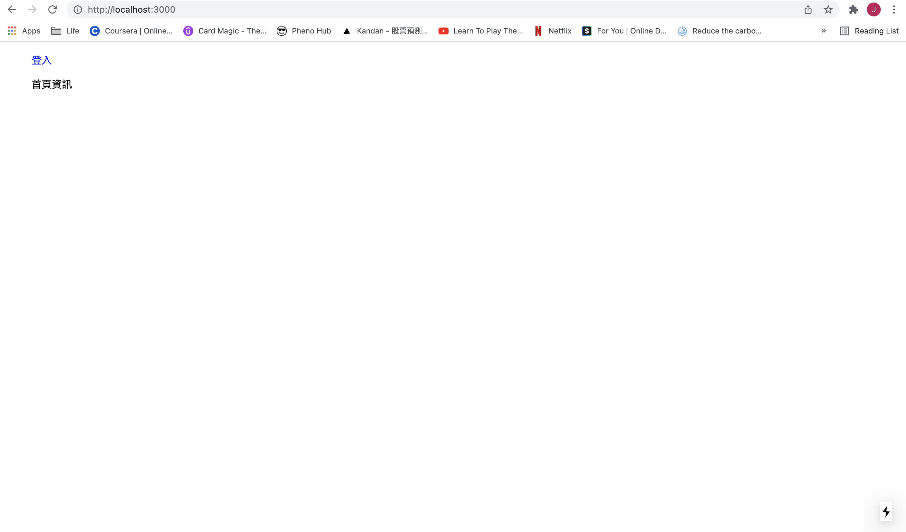
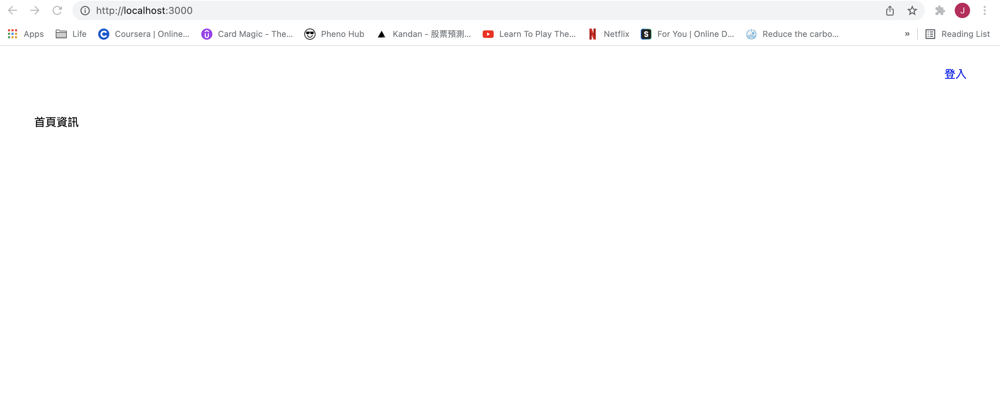
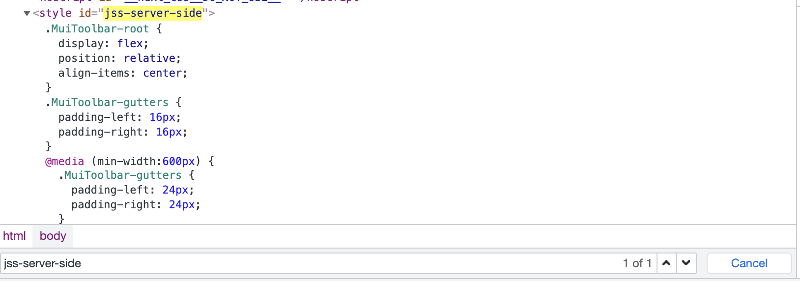

# 第一章

- 設定 Node.js 專案
  - 安裝 Node.js 及 Yarn
  - package.json
- VS code 編輯器及 lint
  - VS code 編輯器
  - ESLint 及 Prettier
- 設定 Next.js 專案
  - 基本架構
  - 編譯程式
  - Document HOC
  - App HOC
  - Index 頁面
  - Header 元件
- 整合 Material-UI
  - 在伺服器端注入 style 及渲染頁面
  - theme 及 ThemeProvider
  - 移除伺服器端注入的 style
  - 測試 Next.js/Material-UI 的整合結果
- 伺服器端渲染（server-side rendering）
- 客製你的 style

---

我們已經說明過了我們寫這本書並且開發這個網路應用程式的動機了。而動機除外，這本書跟多數其他的書差異點在於會**從零開始**帶你開發出一個使用現代技術且可商業使用的軟體。到第九章的時候，我們會一起寫出將近 4,000 行程式碼。

在我們開工之前，先取得`1-begin`的程式碼。[1-begin](https://github.com/menon-pheno/fullstack-bookstore/tree/master/book/1-begin)資料夾位於[fullstack-bookstore repo](https://github.com/menon-pheno/fullstack-bookstore)`book`的目錄內。

- 如果你還沒有將 fullstack-bookstore 給 clone 下來的話，用`git clone https://github.com/menon-pheno/fullstack-bookstore`這個指令將 repo 複製到你的電腦上
- 注意：如果你想要用自己的 GitHub 帳號自己管理程式的話，你應該將我們的 repo fork 出來並且執行`git clone https://github.com/<你的 github 名稱>/fullstack-bookstore.git`。這樣你就可以將你的改動直接 push 到你的`fullstack-bookstore` repo
- 在`1-begin`的資料夾內執行`yarn`來安裝所有的套件

接下來，我們會在這章教你如何安裝 node.js 及 yarn。然後我們會在第一章內安裝以下的套件：

- `"@material-ui/core"`
- `"@material-ui/styles"`
- `"next"`
- `"prop-types"`
- `"react"`
- `"react-dom"`

看一下我們第一章的[package.json](https://github.com/menon-pheno/fullstack-bookstore/blob/master/book/1-begin/package.json)。

請確定使用我們指定的套件跟版本，並忽略任何升級的警告。我們會定期更新套件且測試相容性。我們無法確保新的套件版本與目前的程式碼都相容，套件升級時有的時候會導致一些預料之外的問題。

我們鼓勵且歡迎你在閱讀本章的時候，可以在我們的 GitHub repo: [https://github.com/menon-pheno/fullstack-bookstore/issues/new](https://github.com/menon-pheno/fullstack-bookstore)回報任何 bug、錯字或是任何解釋不清楚的地方。

---

## 設定 Node.js 專案

在這本書裡我們使用的作業系統為 macOS Montery 12.1。因此我們所寫的步驟在其他 Linux 為基礎的作業系統絕大多數都會適用（例如 Debian 及 Ubuntu）。並且我們使用 Visual Studio code 作為我們的編輯器（[https://code.visualstudio.com](https://code.visualstudio.com)）。這安裝在我們的開發電腦上，還滿推這個編輯器，輕量但是又有充足的設定方式。

本書開發的網路應用程式具有許多的內部及外部 API 架構。在開發內部 API 時，你會學習到有關於 HTTP request-response 週期、Express 伺服器（routes、middleware、router、methods）、API methods 及 Mongoose API。在開發外部 API 架構時，你會學到有關於 Google API、AWS SES API、Github API、LinePay API 及 Mailchimp API 的服務。

我們這個書店程式的核心技術堆棧為：

- 使用者會看到的部分為：Next.js、React.js、Material-UI
- 伺服器端的部分為：Next.js、Node.js、Next.js、Express.js、Mongoose.js、Ｍ ongoDB 資料庫

你也會學到如何 SEO 來優化你的被搜尋成效，並且部署你的軟體到 Heroku 及 AWS Elastic Beanstalk。

我們強烈建議你看一下我們的為於[https://TODO](https://TODO)的章節目錄及我們的公共 repo [https://github.com/menon-pheno/fullstack-bookstore](https://github.com/menon-pheno/fullstack-bookstore) 以多了解這本書會介紹的東西。

---

### 安裝 Node.js 及 Yarn

我們要建立一個 [Node.js](http://nodejs.org) 專案（通常都簡稱 Node），我們在專案內所使用的套件（library/package）多數是專為 Node 專案所開發的。

我強力建議使用 `nvm`（Node Version Manager） 來安裝 Node：

[https://github.com/creationix/nvm](https://github.com/creationix/nvm)

在 Ubuntu 或 Linux 平台上，按 Ctrl+Alt+T 來開啟你的終端器（也可以透過搜尋來找 terminal）。

- 執行下面的指令來安裝 nvm：

```
curl -o- https://raw.githubusercontent.com/creationix/nvm/v0.33.11/install.sh | bash
```

- 檢查 nvm 是否有安裝成功：

```
nvm --version
```

- 啟動 nvm：

```
. ~/.nvm/nvm.sh
```

- 安裝 Node 12.13.0：

```
nvm install 12.13.0
```

- 將這個 Node 版本設為預設：

```
nvm alias default 12.13.0
```

- 檢查 Node 版本是否有正確安裝跟使用

```
node -v
```

Node 的版本現在應該是 12.13.0。

在 Node 安裝好之後，我們就可以安裝 Yarn。Yarn 是一個管理 Node third-party 套件（常見的名稱有 package、module、library）的軟體。每當我們需要使用一個由別的開發者所提供的套件時，我們就將套件的名稱與版本加到 `package.json` 檔案裡，然後在這個專案的目錄下執行 `yarn` 這個指令（另外個方式是執行 `yarn add packageName@packageVersion`）。下個小節會對 `package.json` 再多做介紹。

如果你使用的是 Ubuntu：

- 在終端機裡執行以下的兩個指令來取得 Yarn 的 Debian package repo（[https://yarnpkg.com/en/docs/install#linux-tab](https://yarnpkg.com/en/docs/install#linux-tab)）：

```
curl -sS https://dl.yarnpkg.com/debian/pubkey.gpg | sudo apt-key add - echo "deb https://dl.yarnpkg.com/debian stable main" | sudo tee /etc/apt/sources.list.d/yarn.list
```

- 接著安裝 Yarn：

```
sudo apt-get update && sudo apt-get install yarn
```

- 檢查 Yarn 版本來確認是否安裝成功：

```
yarn -v
```

如果你使用的是其他的作業系統，特定的步驟可以參考以下：

[https://classic.yarnpkg.com/en/docs/install](https://classic.yarnpkg.com/en/docs/install)

從下拉選單內選擇你的作業系統及 Yarn 版本。

在本書中所使用的 Node 版本為 `12.13.0`，Yarn 版本為 `1.22.4`。

---

### package.json

在所有的 Node 專案的根目錄下都必須有 `package.json` 這個檔案。這個檔案會存放該專案的元資料（metadata）：名稱、版本、腳本及相依的套件（由名稱與版本來描述與指定）等。有興趣多了解的可以參考下面的連結：

[https://docs.npmjs.com/getting-started/using-a-package.json](https://docs.npmjs.com/getting-started/using-a-package.json)

有的參數並非必要的，例如 `keywords` 跟 `license`，但是有的參數是必須的，像是 `name` 及 `version`。

打開位於 [https://github.com/menon-pheno/fullstack-bookstore/tree/main/book/1-begin](https://github.com/menon-pheno/fullstack-bookstore/tree/main/book/1-begin) 的 `1-begin` 資料夾。

我們來看一下 `package.json` 的內容（節錄）：

```Javascript
{
  "name": "1-begin",
  "version": "0.0.1",
  "license": "MIT",
  "scripts": {
    "dev": "next",
    "build": "next build",
    "start": "next start",
    "lint": "eslint '**/*.jsx'"
  },
  "dependencies": {
    "@material-ui/core": "^4.11.4",
    "@material-ui/styles": "^4.11.4",
    "next": "^9.1.2",
    "prop-types": "15.7.2",
    "react": "^16.13.1",
    "react-dom": "^16.13.1"
  }
}
```

可以看到必須存在的元資訊例如 `name` 及 `version` （`version` 的格式是 `major.minor.patch`）。

`package.json` 內的 `scripts` 部分紀錄了指令的捷徑。本書的第二章裡面，我們會將下列的指令加到 `scripts` 裡：

```Javascript
"dev": "nodemon server/server.js --watch server"
```

這個捷徑可以讓我們只要在終端機裡打 `yarn dev` 而不用打：

```
yarn nodemon server/server.js --watch server
```

目前看不懂上面寫的指令沒問題的，我們會在第二章建立 Next.js/Express.js 混合伺服器的時候做說明。在這章中，還沒有伺服器端的程式碼，當然就還沒有啟動伺服器的需求，你將透過 `yarn dev` 這個指令來執行你的專案，這等同於執行 `yarn next` 因為在我們的 `scripts` 屬性內紀錄了 `"dev": "next"`。

在 `scripts` 裡面，你可以在指令裡面指定你要的環境變數。做法是在 `scripts` 內的指令加上一個例如 `NODE_ENV=production` 的前置字串。舉例來說，在這本書的尾聲，當我們要把成編譯完並且做正式部署時，我們會用以下的捷徑指令進行 `yarn build` 這的動作：

```Javascript
"build": "NODE_ENV=production next build"
```

在上面的這個例子中，`NODE_ENV` 的值會被明確地設定為 `production`。如果沒有特別指定 `NODE_ENV` 的值，它預設是會被設定為 `development`。Next.js 會根據我們所指定的將專案的程式碼在 `NODE_ENV` 為 `production` 的設定下來編譯程式，這樣就可以部署到正式環境。

我們會在第二章中討論環境變數以及如何利用 `dotenv` 套件來管理它們。第二章內我們也會探討如何管理伺服器端的環境變數。到了第八章的時候，我們會描述如何將環境變數同時提供到伺服器端與瀏覽器端。

`package.json` 接下來的部分就是 `dependencies`。這個區塊會列出所有我們在**正式環境及測試環境**都會需要的第三方套件。你只要在終端機位於專案的目錄下（以我們目前的內容為例，在`book/1-begin/`）執行 `yarn` 這個指令就會安裝 `dependencies` 所指定的套件了。

你可以透過在專案的根目錄下檢查是否有個新產生的 `node_module` 資料夾以及是否有產生 `yarn.lock` 這個檔案來確認是否有正確的安裝完你所指定的套件。`node_module` 會存放這些套件的程式碼，而 `yarn.lock` 則是會記載著這些套件的版本號已經個套件有的額外相依套件資訊。

`devDependencies` 則是列出我們專案內只有開發環境會使用但是正式環境不會使用的套件。通常開發者會利用 `devDependencies` 內的套件進行測試、在本機端編譯程式及 lint 程式碼。

如果你有在 `1-begin` 這個資料夾內執行 `yarn` 這個指令，你就成功的將 `dependencies` 這個屬性內的全部套件給安裝成功了。`devDependencies` 裡的內容我們會在接下來討論 linting 程式碼的部分做講解。

---

## VS code 編輯器及 lint

在這節，我們會在 VS code 編輯器上進行一些設定，讓我們可以自動儲存檔案，以及在每次進行手動存檔的時候進行自動 lint。我們也會討論如何使用 ESLint 及 Prettier 來設定 linting 程式碼的動作。

---

### VS code 編輯器

在本書中我們會推薦你使用 Visual Studio code 編輯器（[https://code.visualstudio.com](https://code.visualstudio.com)），我們是認為它在效能與功能上達到一個滿好的平衡點，並且與 linter 及 Github 都有相當好的整合。它也自備終端機－因此你可以在編輯器內就執行你的專案。以下是這個編輯器的範例畫面，也可以看到我們目前有一個 staged change：



VS code 編輯器更有很多可以提高生產力的設定選項。VS code 編輯器的設定有兩種：使用者設定（User setting）及工作區設定（Workspace setting）。可以在以下的官方文件看一下兩者的差別：

[https://code.visualstudio.com/docs/getstarted/settings](https://code.visualstudio.com/docs/getstarted/settings)

簡單說，使用者設定原則上會適用於你所有本機上的專案，而工作區設定則是可以拿來針對特定專案的設定，工作區的設定會優先於使用者設定。

我們在 repository 的根目錄下提供了這個專案的工作區設定。
這些設定放在 `.vscode` 的資料夾內的 `settings.json` 及 `extensions.json` 檔內。嚴格來說， `extension.json` 內並沒有進行設定，但是它指定了我們接下來要安裝的擴充套件。

`.vscode/extensions.json`：

```Javascript
{
  "recommendations": ["dbaeumer.vscode-eslint"]
}
```

你可以在 `Code` > `Preferences` > `Settings` > `Workspace` 內看到你的工作區設定。



點擊螢幕右上方的檔案圖示（`Open Settings (JSON)`）可以看到以 JSON 格式呈現整理出的整體工作區設定。

底下是我們提供的工作區設定－打開 `.vscode/settings.json`：

```Javascript
{
  "window.zoomLevel": 0,
  "files.autoSave": "afterDelay",
  "git.enableSmartCommit": true,
  "editor.formatOnSave": true,
  "editor.defaultFormatter": "dbaeumer.vscode-eslint",
  "eslint.alwaysShowStatus": true,
  "eslint.validate": [
    "javascript",
  ],
  "editor.codeActionsOnSave": {
    "source.fixAll.eslint": true
  },
  "eslint.workingDirectories": [
    {
      "directory": "./fullstack-bookstore/",
      "changeProcessCWD": true
    },
    {
      "directory": "./book/9-end/",
      "changeProcessCWD": true
    },
    {
      "directory": "./book/9-begin/",
      "changeProcessCWD": true
    },
    {
      "directory": "./book/8-end/",
      "changeProcessCWD": true
    },
    {
      "directory": "./book/8-begin/",
      "changeProcessCWD": true
    },
    // 以下類推
  ],
}
```

- `"window.zoomLevel": 0` 會將縮放設定在 80%－這是我們的個人偏好，字體稍微小一點，可以少滑動一些。

- `"files.autoSave": "afterDelay"` 會自動存檔，免去手動存檔的需要。

- `"git.enableSmartCommit": true` 會在沒有 staged 的變化時候，將改動全部 commit。

你可以在官方的 VS code 編輯器網站了解所有的設定所代表的意義：

[https://code.visualstudio.com/docs/getstarted/settings#\_default-settings](https://code.visualstudio.com/docs/getstarted/settings#_default-settings)

我們接者來討論一下程式碼 linting，還有稍微帶過上面沒提到的一些設定。

---

### ESLint 及 Prettier

我們使用 Dirk Baeumer（[https://github.com/dbaeumer](https://github.com/dbaeumer)）所提供的 ESLint 擴充套件來提示程式碼有格式上的問題甚或是進行自動格式化的功能。我們提供了 ESLint 的設定，另外值得一提的是，我們也有使用 Esben Petersen（[https://github.com/esbenp](https://github.com/esbenp)）所開發的 Prettier 格式化的套件。

ESLint（[https://eslint.org](https://eslint.org)）負責的是校驗程式碼，簡言之，它會檢查程式碼有的潛在格式問題，進而直接修改這些問題。Prettier（[https://prettier.io/docs/en/index.html](https://prettier.io/docs/en/index.html)）也是一個程式碼的格式化工具。要達到能夠在 VS Code 編輯器內直接進行自動的標註有問題的程式碼格式以及自動修改格式，我們要進行下列四個準備：

- 在 VS code 編輯器安裝 `dbaeumer.vscode-eslint` 這個擴充套件

- 增加所需要的工作區設定（上一節我們已經做好了）

- 在專案 `package.json` 內的 `devDependencies` 屬性加上 `prettier`（我們所提供的 `package.json` 已經提供了這個項目，你執行完 `yarn` 這個指令後就會完成安裝）

- 提供一個 `.eslintrc.js` 檔案供 ESlint 使用

值得一提的是，你不需要 `dbaeumer.vscode-eslint` 這個擴充套件也是可以使用 ESLint 以及 Prettier 的。你可以自行安裝 `eslint` 與 `prettier` 套件，然後在你程式碼內的資料夾執行 `eslint '**/*.js' '**/*.jsx'` 這個指令來找到全部的格式化相關的問題。那我們為什麼需要安裝 `dbaeumer.vscode-eslint` 並且進行這些設定？因為我們的目標是要 VS code 編輯器自動的標註格式化的問題，還有在手動存檔的時候能夠自動的修改。

- `"editor.formatOnSave": true`，從官方文件可以看到：

> Format a file on save. A formatter must be available, the file must not be saved after delay, and the editor must not be shutting down.

> 在存檔的時候將檔案格式化。必須存在一個可用的格式化套件、非透過 after delay 的自動存檔、以及編輯器並非在關閉的過程中。

需注意的是，自動格式化並不會在 VS code 編輯器自動存檔的時候進行。只有在手動存檔的時候才會發生。

- `"editor.defaultFormatter": "dbaeumer.vscode-eslint"`，從官方文件可以看到：

> Defines a default formatter which takes precedence over all other formatter settings. Must be the identifier of an extension contributing a formatter.

> 定義預設的格式化工具，會優先於其他所有的格式化設定。必須指定一個格式化工具的 identifier。

在 VS 編輯器左側，點選 `Extensions` 的套件，安裝 ESLint 這個擴充套件：



我們 `.vscode/settings.json` 內的其餘設定就是 `dbaeumer.vscode-lint` 所需要的設定：

```Javascript
  "eslint.packageManager": "yarn",
  "eslint.alwaysShowStatus": true,
  "eslint.validate": [
    "javascript",
  ],
  "editor.codeActionsOnSave": {
    "source.fixAll.eslint": true
  },
  "eslint.workingDirectories": [
    // ESLint 會有作用的目錄列表
  ]
```

這些設定應該不需要額外的解釋，字面上就相當清楚，不過有興趣的話可以看一下這個擴充套件的文件：

[https://marketplace.visualstudio.com/items?itemName=dbaeumer.vscode-eslint](https://marketplace.visualstudio.com/items?itemName=dbaeumer.vscode-eslint)

---

前面說的四個事項就只剩下：

- 提供一個 ESLint 的組態檔 `.eslintrc.js`

ESLint 需要一個 `.eslintrc.js` 組態檔來指定將檔案格式化的設定為何。這些設定包含使用單引號還是雙引號、要不要在物件的屬性或是陣列的最後一個元素加上個逗號、一行程式碼最大長度等等的設定。除了這章我們會讓你自己嘗試新增一個 `.eslintrc.js` 做為練習之外，之後的每一章我們都直接提供了對應的 `.eslintrc.js` 檔案。意思是，`book/2-begin` 及 `book/2-end` 都會有自己的 `.eslintrc.js`（當然其他章節也都有），另外我們在 `.vscode/settings.json` 也在 `eslint.workingDirectories` 加上了每個章節的目錄。

在你 `book/1-begin` 的資料夾內，新增一個 `.eslintrc.js` 檔案，內容如下：

```Javascript
module.exports = {
    parser: 'babel-eslint',
    extends: ['airbnb', 'plugin:prettier/recommended'],
    env: {
      browser: true,
      jest: true,
    },
    plugins: ['react', 'jsx-a11y', 'import', 'prettier'],
    rules: {
      'prettier/prettier': [
        'error',
        {
          singleQuote: true,
          trailingComma: 'all',
          arrowParens: 'always',
          printWidth: 100,
          semi: true
        },
      ],
      'camelcase': 'off',
      'no-underscore-dangle': ['error', { allow: ['_id'] }],
      'no-mixed-operators': 'off',
      'prefer-arrow-callback': 'error',
      'prefer-destructuring': [
        'error',
        {
          VariableDeclarator: {
            array: false,
            object: true,
          },
          AssignmentExpression: {
            array: true,
            object: false,
          },
        },
        {
          enforceForRenamedProperties: false,
        },
      ],
      'import/prefer-default-export': 'off',
      'jsx-a11y/anchor-is-valid': 'off',
      'react/jsx-wrap-multilines': 'off',
      'react/destructuring-assignment': 'off',
      'react/no-danger': 'off',
      'react/jsx-one-expression-per-line': 'off',
      'react/jsx-props-no-spreading': 'off',
      'react/react-in-jsx-scope': 'off',
      'react/jsx-filename-extension': [
        'error',
        {
          extensions: ['.jsx'],
        },
      ],
    },
  };
```

上述的檔案基本上就指定了我們格式化程式碼的規則為何。有的規則是直接指定，而有的規則是間接指定，幾個直接指定的規則如下：

`import/prefer-default-export`：

[https:/github.com/benmosher/eslint-plugin-import/blob/master/docs/rules/prefer-default-export.md](https:/github.com/benmosher/eslint-plugin-import/blob/master/docs/rules/prefer-default-export.md)

`jsx-a11y/anchor-is-valid`：

[https://github.com/jsx-eslint/eslint-plugin-jsx-a11y/blob/master/docs/rules/anchor-is-valid.md](https://github.com/jsx-eslint/eslint-plugin-jsx-a11y/blob/master/docs/rules/anchor-is-valid.md)

ESLint 支援的所有規則可以參照它的官方文件：

[https://eslint.org/docs/rules](https://eslint.org/docs/rules)

我們也同時透過間接指定的方式參照了一些其他人的規則，這是透過在 `extends` 跟 `plugins` 的屬性內填入該有的值：

```Javascript
extends: ['airbnb', 'plugin:prettier/recommended'],
```

還有：

```Javascript
plugins: ['react', 'jsx-a11y', 'import', 'prettier'],
```

將 `airbnb` 加到 `extends` 當中，我們就會自動引入並且使用 `eslint-config-airbnb` 這個 library 所設定的規則：

[https://eslint.org/docs/user-guide/configuring#extending-configuration-files](https://eslint.org/docs/user-guide/configuring#extending-configuration-files)

[https://www.npmjs.com/package/eslint-config-airbnb](https://www.npmjs.com/package/eslint-config-airbnb)

而將 `plugin:prettier/recommended` 加到 `extends`，我們則會將 ESLint 裡面與 Prettier 衝突的規則給關閉：

[https://www.npmjs.com/package/eslint-config-prettier](https://www.npmjs.com/package/eslint-config-prettier)

根據官方文件，我們必須要做以上的設定，並且要將 `prettier` 加到 `plugins`：

[https://github.com/prettier/eslint-plugin-prettier#recommended-configuration](https://github.com/prettier/eslint-plugin-prettier#recommended-configuration)

在 `plugins` 屬性內增加的值並不會直接新增或是強制格式化的規則，但是可以提供我們使用任何額外間接指定規則的選項。

[https://stackoverflow.com/questions/53189200/whats-the-difference-between-plugins-and-extends-in-eslint](https://stackoverflow.com/questions/53189200/whats-the-difference-between-plugins-and-extends-in-eslint)

[https://eslint.org/docs/user-guide/configuring#configuring-plugins](https://eslint.org/docs/user-guide/configuring#configuring-plugins)

而要使用 ESLint 及 Prettier 正確運作，我們要安裝它們所需要的相依性，在 `package.json` 檔案內的 `devDependencies` 屬性內加上以下的內容，然後執行 `yarn`（以後的章節我們就直接提供了）：

```Javascript
"devDependencies": {
  "babel-eslint": "^10.1.0",
  "eslint": "^6.7.2",
  "eslint-config-airbnb": "^18.2.1",
  "eslint-config-prettier": "^6.15.0",
  "eslint-plugin-import": "^2.22.1",
  "eslint-plugin-jsx-a11y": "^6.4.1",
  "eslint-plugin-prettier": "^3.1.4",
  "eslint-plugin-react": "^7.21.5",
  "eslint-plugin-react-hooks": "^4.2.0",
  "prettier": "^2.2.1"
}
```

安裝後，我們可以看看在指定了 `extends: 'airbnb'` 到底新增了什麼規則。打開 `book/1-begin/node_modules/eslint-config-airbnb-base/rules/` 這個資料夾，裡面就會看到很多 JS 檔案。`best-practices.js` 記載了大部分 airbnb 所建議的規則。你都可以在 `node_modules` 裡找到其他我們在 `extends` 及 `plugins` 屬性內指定的條件。

---

說了這麼多，我們來看一下設定完 ESLint 及 Prettier 後的效果吧，我們先來試試 ESLint。

在 `1-begin` 資料夾下新增一個 `test.jsx`，輸入以下的內容：

```Javascript
[1, 2, 3].map(function (x) {
  const y = x + 1;
  return x * y;
});
```

ESLint 會標示警告，你可以透過滑鼠移到警告或是在下方看到解釋：

```
[eslint] Unexpected unnamed function. (func-names)
[eslint] Unexpected function expression. (prefer-arrow-callback)
```



這個警告來自於[Airbnb 使用箭頭函式的規則](https://github.com/airbnb/javascript#arror-functions)。只要 `Ctrl+S` 手動存檔，ESLint 就會將檔案自動修改為：

```Javascript
[1, 2, 3].map((x) => {
  const y = x + 1;
  return x * y;
});
```

如同我們上面所提到的，當工作區設定有 `"eslint.autoFixOnSave": true` 且手動存檔的時候，ESLint 就會自動將警告給修復。

你也可以找出你專案內所有的 ESLint 問題。只要在 `package.json` 裡面的 `scripts` 屬性加上：

```Javascript
"lint": "eslint '**/*.jsx'"
```

在這節的前頭，我們有提到使用 `eslint '**/*.js' '**/*.jsx'`，不過由於目前為止，我們還沒有任何 `.js` 檔，所以如果你加上 `**/*/js` 的話會有錯誤。

`scripts` 屬性現在會變成：

```Javascript
"scripts": {
  "dev": "next",
  "build": "next build",
  "start": "next start",
  "lint": "eslint '**/*.jsx'"
}
```

到我們這章結尾時，你的專案內也會包含 `.js` 檔案，因此，你會看到 `1-end` 資料夾的 `package.json` 裡面有 `eslint '**/*.js' '**/*.jsx'` 的腳本指令。

回到 `test.jsx` 把有 ESLint 警告的程式碼給重新貼上：

```Javascript
[1, 2, 3].map(function(x) {
  const y = x + 1;
  return x * y;
});
```

在 `1-begin` 資料夾內執行 `yarn lint` 就會看到 ESLint 所發現的錯誤與警告：

```
Johns-MacBook-Pro-2:book pheno$ cd 1-begin
Johns-MacBook-Pro-2:1-begin pheno$ yarn lint
yarn run v1.22.4
$ eslint '**/*.jsx'

/Users/pheno/Downloads/workspace/book-store/fullstack-bookstore/book/1-begin/test.jsx
  1:15  error    Unexpected function expression  prefer-arrow-callback
  1:15  warning  Unexpected unnamed function     func-names
  1:23  error    Insert `·`                      prettier/prettier

✖ 3 problems (2 errors, 1 warning)
  2 errors and 0 warnings potentially fixable with the `--fix` option.
```

方便的是，你可以透過執行 `yarn lint --fix` 來把程式碼格式的問題修復。執行 `yarn lint --fix`，你會看到 `test.jsx` 內的檔案被 ESLint 修改了。

如果你想要阻止 ESLint 在你某部分的程式碼上報警或是修改，你可以指定特定行數或是針對整個檔案關閉 ESLint 的功能。

如果只想針對某行程式碼關閉 ESLint 功能，在該行加上：

```
// eslint-disable-line
```

針對整個檔案關閉的話，則是在檔案的最上方加上：

```
/* eslint-disable */
```

在看完 ESLint 之後，讓我們看一下 Prettier。

打開 `test.jsx`，在最後面加上以下的程式碼：

```
foo(reallyLongArg(), superLongArg(), incrediblyLongArg(), probablyNeedRefactoring(), howManyAreThere());
```

看一下 ESLint 所顯示的警告：

```
Replace `reallyLongArg(),·superLongArg(),·incrediblyLongArg(),·probablyNeedRefactoring(),·howManyAreThere()` with `⏎··reallyLongArg(),⏎··superLongArg(),⏎··incrediblyLongArg(),⏎··probablyNeedRefactoring(),⏎··howManyAreThere(),⏎` eslint(prettier/prettier)
```

可以看到 `prettier/prettier` 告訴了我們這行太長，應該要重新格式化。用 `Ctrl+s` 存檔，程式碼會變為：

```
foo(
  reallyLongArg(),
  superLongArg(),
  incrediblyLongArg(),
  probablyNeedRefactoring(),
  howManyAreThere(),
);
```

補充說明一下，上面的換行格式化，是透過 Prettier 的套件，而非由 ESLint 所更動的。

記得移除 `test.jsx` 檔案。

到這邊我們準備好前置作業了，可以寫出比較乾淨、可讀、格式化的程式碼了。下一節開始我們會探討如何架構你的 Next.js 專案。

---

## 設定 Next.js 專案

在本節，我們會探討如何架構一個基本的 Next.js 專案，我們會：

- 討論 Next.js 如何編譯程式
- 討論 `Document` HOC 並且實作
- 討論 `App` HOC 並且實作
- 實作 `Index` 頁面
- 實作 `Header` 元件

---

### 基本架構

Next.js（[https://nextjs.org/docs](https://nextjs.org/docs)）提供了許多不錯用的功能，其中幾項如下：

- 可以彈性選擇是否要做伺服器端的渲染：[https://nextjs.org/docs/basic-features/data-fetching](https://nextjs.org/docs/basic-features/data-fetching)
- 簡單易用的頁面路由設定：[https://nextjs.org/docs/basic-features/pages](https://nextjs.org/docs/basic-features/pages)
- 程式碼熱更新：[https://nextjs.org/docs/basic-features/fast-refresh](https://nextjs.org/docs/basic-features/fast-refresh)
- 預設與可客製化的錯誤處理（404 及 500 HTTP 錯誤）： [https://nextjs.org/docs/advanced-features/custom-error-page#404-page](https://nextjs.org/docs/advanced-features/custom-error-page#404-page)
- 程式碼編譯設定：[https://nextjs.org/docs/advanced-features/customizing-babel-config](https://nextjs.org/docs/advanced-features/customizing-babel-config)

除此之外，Next.js 使用 [webpack](https://webpack.js.org) 來自動包裝模組（例如頁面與元件），不需要開發者再做其他的設定。簡單來說，如果你想要快速地開始開發，而不想要花太多時間選擇工具以及做設定，再加上如果你有些畫面想要有伺服器端的渲染功能（為了使用者體驗及 SEO），那 Next.js 是個不錯的選擇。

下面是 Next.js 所提供的一個簡單的教學課程，滿推薦你上一遍：

[https://nextjs.org/learn/basics/create-nextjs-app](https://nextjs.org/learn/basics/create-nextjs-app)

我們會在本章最後的小節探討伺服器端渲染與瀏覽器端渲染的一些細節。

如果你有在 `1-begin` 裡面執行過 `yarn`，那你已經安裝了 Next.js。我們來檢查一下：

1. 在 `1-begin` 裡新增一個 `pages` 資料夾
2. 在終端機裡於 `1-begin` 路徑下執行 `yarn build` 這個指令

`next` 這個套件會在根目錄下新增一個 `.next` 資料夾。你也可以嘗試執行 `yarn dev`，這樣會在 `http://localhost:3000` 的路徑下啟動你的應用程式。不過嘗試造訪的時候，會看到一個 404 頁面，這是因為目前我們的專案還沒有任何頁面。

Next.js 對於如何架構你的專案有一些規範。其中最主要的是，你將各頁面的程式碼存放在 `/pages`(這也是為什麼前面我們提到要新增一個 `pages` 資料夾)，而裡面的每個檔名就會對應成為該頁面的路由。

我們將 react 元件以及靜態檔案（例如圖片等）對應的存放在 `components` 以及 `public` 資料夾內。一個重要的題外話，我們強力建議在準備部署到正式環境時，將 `public` 內的資料改存放到 content delivery network(CDN)上。我們會將靜態資料存放到 Google Cloud Platform 以及 AWS：

```
├── components              # React 元件
├── lib                     # client 及 server 都可使用的程式碼
├── pages                   # 實際瀏覽器會看到的頁面
├── server                  # 伺服器端程式碼
├── public                  # 靜態資源
├── package.json            # 套件以及腳本的資訊
```

上面是我們整理程式碼的方式，我們將被頁面引用的模組例如高階元件（higher-order component, HOC）、非頁面的 React 元件及 API 函式放在 `lib` 資料夾。`lib` 資料夾內的程式可以在伺服器端或是瀏覽器端執行。如果某頁面是瀏覽器端渲染的（client-side render），則 HOC 與 API 函式是在瀏覽器端執行。若頁面是伺服器端渲染（server-side render），則 HOC 與 API 函式是在伺服器端執行。

我們將**只有伺服器端**使用的程式碼，例如 Express 伺服器程式、Express 路由、Express 中介軟體（middleware）及介接第三方的 API 程式，放在 `server` 資料夾內。

Next.js 讓你可以透過在專案的根目錄下新增一個 `next.config.js` 檔案來自行調整 webpack 的設定。你也可以透過 `pages/_error.js` 這個檔案來客制你自己的 404 及 500 錯誤頁面。

我們本書中不會去動 webpack 或是錯誤頁面，但是我們會透過 `pages/_document.jsx` 以及 `pages/_app.jsx` 來客制我們的 `Document` 以及 `App` 高階組件。

---

### 編譯程式

Babel（[https://babeljs.io](https://babeljs.io)）是一個 JavaScript 的編譯器。它會將我們身為軟體工程師所寫的 JavaScript 程式碼轉換成瀏覽器看得懂的 JavaScript。一般來說，我們會需要設定 `babel` 並指定所使用的預置（preset）後才能正確地使用 Babel。

Babel 預置指的是一組可以拿來支援特定程式語言功能的插件軟體（plugin）。舉例來說，`react` 預置用來支援 `JSX` 的功能，而 `es2015` 預置用來支援 `ES2015/ES6` 功能。你透過在專案根目錄的 `.babelrc` 檔案指定所要用的預置（[https://babeljs.io/docs/plugins/#presets](https://babeljs.io/docs/plugins/#presets)）以及插件軟體（[https://babeljs.io/docs/plugins/#transform-plugins](https://babeljs.io/docs/plugins/#transform-plugins)）。

Next.js 本身內部就有使用 Babel：

[https://nextjs.org/docs/advanced-features/customizing-babel-config](https://nextjs.org/docs/advanced-features/customizing-babel-config)

[https://github.com/vercel/next.js/blob/a442841517280ae19d24133f9396e432dadd8988/package.json#L39](https://github.com/vercel/next.js/blob/a442841517280ae19d24133f9396e432dadd8988/package.json#L39)

再次強調，因為 Next.js **內部**就有使用 Babel 來編譯頁面的程式碼，我們就不需要再使用 `.babelrc` 來設定 Babel。

如果你在寫其他的軟體而需要客制設定 Babel 的話，可以參考下列說明如何在 Next.js 專案設定 Babel 的連結：

[https://github.com/vercel/next.js/tree/canary/examples/with-custom-babel-config](https://github.com/vercel/next.js/tree/canary/examples/with-custom-babel-config)

簡單來說，你會新增一個類似於以下的 `.babelrc` 檔案：

```JavaScript
{
  "presets": ["next/babel"],
  "plugins": []
}
```

這樣 Next.js 的預設行為就會被此 `.babelrc` 檔案給覆蓋掉。

值得注意的是 — Next.js 透過 `babel` 會將所有被 **pages** 引用的模組給編譯。
這指的是 `components`、`lib` 以及任何被 import 進 `pages/*` 的程式碼都會被 Next.js 利用 `babel` 給編譯過。因此，我們可以使用比較新的 `import/export` 語法而不需要使用舊的 `require/module.exports` 語法。

不過，Next.js 並**不會編譯伺服器端的程式碼**（至少在本書使用的 Next.js 版本並不會）。因此，我們的純伺服器端的程式碼只好使用比較舊的 `require/module.exports` 語法。

我們也提供了一個 `.gitignore` 檔案，裡面一個重要的項目是包含了 `.env` 的檔案類型。`.env` 會是你存放環境變數的地方（第二章）。這個檔案內的內容多數都是需要保密的，**不要**將此檔案傳到 Github 上！

在接下來的四個小節，我們要進行跟開發以下的幾個項目：

- 探討 `Document` HOC 並且實作
- 探討 `App` HOC 並且實作
- `Index` 頁面
- `Header` 元件

---

### Document HOC

在 Next.js 裡，你不需要在每個頁面都加上 `<head>`、`<html>` 及 `<body>` 這些常見的 html 元素。這些元素會被自動地注入到頁面裡，而你更可以透過定義 `MyDocument` 這個 `Document` HOC 來客製化這些共用的元素：

[https://nextjs.org/docs/advanced-features/custom-document](https://nextjs.org/docs/advanced-features/custom-document)

高階組件（higher-order component）指的是一個將 `WrappedComponent` 當參數傳入並輸出一個 `EnhancedComponent` 的純函式：

```JavaScript
const EnhancedComponent = higherOrderComponent(WrappedComponent);
```

[https://nextjs.org/docs/advanced-features/custom-document](https://nextjs.org/docs/advanced-features/custom-document)

我們可以透過 Next.js 的 `Document` 元件來定義常見的 `<head>`、`<html>` 及 `<body>` 及共用的風格，讓我們的 Next.js 網路應用程式可以共同使用。根據 Next.js 的文件，我們用 `pages/_document.jsx` 來延伸 `Document` HOC：

[https://nextjs.org/docs/advanced-features/custom-document](https://nextjs.org/docs/advanced-features/custom-document)

我們會寫一個 ES6 的 `MyDocument` 類別，它會 `extends` `Document` 這個高階組件：

[https://reactjs.org/docs/components-and-props.html#function-and-class-components](https://reactjs.org/docs/components-and-props.html#function-and-class-components)

[https://developer.mozilla.org/en-US/docs/Web/JavaScript/Reference/Statements/class](https://developer.mozilla.org/en-US/docs/Web/JavaScript/Reference/Statements/class)

[https://developer.mozilla.org/en-US/docs/Web/JavaScript/Reference/Classes/extends](https://developer.mozilla.org/en-US/docs/Web/JavaScript/Reference/Classes/extends)

上述的連結裡有個簡單的範例：

```JavaScript
class Square extends Polygon {
  constructor(length) {
    super(length, length);
    this.name = 'Square';
  }
}
```

我們的做法很類似上面，不過 `MyDocument.constructor` 不存在，我們會 override `MyDocument.render` 這個函式。新增一個 `pages/_document.jsx`，內容如下：

```JavaScript
import Document, { Head, Html, Main, NextScript } from 'next/document';

export default class MyDocument extends Document {
  render() {
    return (
      <Html lang="zh-Hant">
        <Head />
        <body>
          <Main />
          <NextScript />
        </body>
      </Html>
    );
  }
}
```

如同多數的網路應用程式，我們的 Next.js 專案在 `<Head>` 元素內應該要有以下的三個子元素：

- 對瀏覽器有意義的元資訊（metadata）－ 例如，行動裝置瀏覽器所該使用的顏色
- 靜態的資源，像是字體與圖示，這些應該由 CDN 提供
- 全域風格（global styles，由所有頁面共用的 styles）

我們另外也在這邊加上：

- 所有頁面的 `<body>` 元素共用的 styles

我們在程式碼內用註記的方式把上述的事項記下，你的 `pages/_document.jsx` 會變成：

```JavaScript
import Document, { Head, Html, Main, NextScript } from 'next/document';

export default class MyDocument extends Document {
  render() {
    return (
      <Html lang="zh-Hant">
        <Head>
          {/* 1. 加上 metadata */}

          {/* 2. 從 CDN 取得靜態資源 */}

          {/* 3. 全域 styles */}
        </Head>
        <body>
          <Main />
          <NextScript />
        </body>
      </Html>
    );
  }
}
```

我們來把實際的程式碼給依序寫進去。

1. 加入下列三個 meta 標籤（[https://www.w3schools.com/tags/tag_meta.asp](https://www.w3schools.com/tags/tag_meta.asp)），雖然這些不是必要的，不過基本上我們會建議你加，可以順便把之前的註解給刪掉了：

```JavaScript
// 告訴瀏覽器你的內容是 UTF-8 編碼
<meta charSet="utf-8" />

// 告訴 google 不要顯示"翻譯此頁"的提示
<meta name="google" content="notranslate" />

// 指定瀏覽器在行動裝置上的顏色
<meta name="theme-color" content="#1976D2" />
```

2. 加入下列五個 CDN 的資源（我們使用 Google Cloud Platform 來存放靜態資源，不過你可以將你的資源上傳到任何其他的 CDN）。我們建議你加入 favicon 圖示、字體、Nprogress（第三章介紹）使用的 style 以及 markdown（第五章介紹）所使用的 style：

```JavaScript
<link
  rel="shortcut icon"
  href="https://storage.googleapis.com/builderbook/favicon32.png"
/>

<link
  rel="stylesheet"
  href="https://fonts.googleapis.com/css?family=Muli:300,400:latin"
/>

<link rel="styesheet" href="https://fonts.googleapis.com/icon?family=Material+Icons" />

<link
  rel="stylesheet"
  href="https://storage.googleapis.com/builderbook/nprogress.min.css"
/>

<link rel="stylesheet" href="https://storage.googleapis.com/builderbook/vs.min.css" />
```

3. 加入 `<a>`、`<blockquote>`、`<pre>`以及 `<code>` 的全域 style。我們的書籍內容會包含前述的後三者元素。在第五章你會接觸到 `marked` 套件，將 `markdown` 轉換成 `HTML`：

```HTML
<style>
  {`
      a {
          font-weight: 400;
          color: #58aa6ff;
          text-decoration: none;
          outline: none;
      }
      blockquote {
          padding: 0 1em;
          color: #555;
          border-left: 0.25em solid #dfe2e5;
      }
      pre {
          display: block;
          overflow-x: auto;
          padding: 0.5em;
          background: #FFF;
          color: #000;
          border: 1px solid #ddd;
      }
      code {
          font-size: 14px;
      }
  `}
</style>
```

用前述的 1 到 3 步取代本來的註解，你的 `pages/_document.jsx` 現在應該變成：

```JavaScript
import Document, { Head, Html, Main, NextScript } from 'next/document';

export default class MyDocument extends Document {
  render() {
    return (
      <Html lang="zh-Hant">
        <Head>
          {/* 告訴瀏覽器你的內容是 UTF-8 編碼 */}
          <meta charSet="utf-8" />
          {/* 告訴 google 不要顯示"翻譯此頁"的提示 */}
          <meta name="google" content="notranslate" />
          {/* 指定瀏覽器在行動裝置上的顏色 */}
          <meta name="theme-color" content="#1976D2" />

          <link
            rel="shortcut icon"
            href="https://storage.googleapis.com/builderbook/favicon32.png"
          />

          <link
            rel="stylesheet"
            href="https://fonts.googleapis.com/css?family=Muli:300,400:latin"
          />

          <link rel="styesheet" href="https://fonts.googleapis.com/icon?family=Material+Icons" />

          <link
            rel="stylesheet"
            href="https://storage.googleapis.com/builderbook/nprogress.min.css"
          />

          <link rel="stylesheet" href="https://storage.googleapis.com/builderbook/vs.min.css" />

          <style>
            {`
                a {
                    font-weight: 400;
                    color: #58aa6ff;
                    text-decoration: none;
                    outline: none;
                }
                blockquote {
                    padding: 0 1em;
                    color: #555;
                    border-left: 0.25em solid #dfe2e5;
                }
                pre {
                    display: block;
                    overflow-x: auto;
                    padding: 0.5em;
                    background: #FFF;
                    color: #000;
                    border: 1px solid #ddd;
                }
                code {
                    font-size: 14px;
                }
            `}
          </style>
        </Head>
        <body>
          <Main />
          <NextScript />
        </body>
      </Html>
    );
  }
}
```

這裡的一個重點在於 `Document` 只會在伺服器端做渲染。本章的後面，我們也會定義一個 `MyDocument.getInitialProps` 函式，它會用來在伺服器端渲染的頁面上注入 Material-UI 內的 style。

---

### App HOC

在上一節，我們為我們的 `Document` HOC 延伸了一個 `MyDocument`。我們也解釋了我們做這個動作的目的 － 為我們的 Next.js 網路應用程式加入共用的元素、styles 以及靜態資源。到本書結束的時候，我們的專案會有八個頁面（其中包含一個 `Index` 頁面，僅作為教學用途）。我們的專案也會有幾個元件是全部的頁面都使用的：

- `CssBaseline`
- `Header`
- `Notifier`

`App` HOC 與 `Document` HOC 不同的地方在於，它在伺服器端與瀏覽器端都可以執行。因此它是個很適合擺放共用網頁配置（layout，例如 `Header` 元件）或是其他共用的元件以及 style（例如 `Notifier` 及 `CssBaseline`）：

[https://nextjs.org/docs/advanced-features/custom-app](https://nextjs.org/docs/advanced-features/custom-app)

你透過 `pages/_app.jsx` 定義一個延伸 `App` HOC 的 `MyApp` 來做想要的修改。因為 `App` 可以在伺服器及瀏覽器上執行，你加到 `MyApp` 的元素會同時存在於伺服器端以及瀏覽器端所渲染的頁面上。本章後面會針對渲染方式再多做介紹。

在第三章我們會自己定義並實作一個 `withAuth` HOC，而不僅是延伸一個既有的 HOC。而我們以後會將頁面元件用這個 `withAuth` HOC 給包起來，如下：

```Javascript
export default withAuth(Index);
```

或

```Javascript
export default withAuth(Login);
```

不過，我們不需要對 `Document` 與 `App` 這兩個 HOC 做這個動作，因為 Next.js 內建就會把所有頁面都用 `Document` 及 `App` HOC 給包起來。

如同我們用 `MyDocument` 延伸 `Document` 的方式，我們定義一個 `extends App` 的 ES6 `MyApp` 類別。新增 `pages/_app.jsx`：

```JSX
import App from 'next/app';
import React from 'react';
import PropTypes from 'prop-types';

const propTypes = {
  Component: PropTypes.elementType.isRequired,
  pageProps: PropTypes.objectOf(PropTypes.object).isRequired,
};

class MyApp extends App {
  render() {
    const { Component, pageProps } = this.props;

    return <Component {...pageProps} />;
  }
}

MyApp.propTypes = propTypes;

export default MyApp;
```

兩個重點：

- `prop-types` 函式庫會針對元件的 props 進行資料類別的檢查（strings、boolean、number、array 等等）。用法是先定義 `propTypes` 然後將它指定到實際的元件上：

```JavaScript
MyApp.propTypes = propTypes;
```

- 雖然我們使用 ES6 的類別裡的 `extends` 來定義 `MyDocument` 及 `MyApp`，我們也可以使用 stateless functional component 來定義並實作它們：

[https://reactjs.org/docs/components-and-props.html](https://reactjs.org/docs/components-and-props.html)

上面的連結裡有描述 ES6 類別定義以及 stateless functional component 定義的方式：

```JSX
class Welcome extends React.Component {
  render() {
    return <h1>Hello, {this.props.name}</h1>;
  }
}
```

```JSX
fuction Welcom(props) {
  return <h1>Hello, {props.name}</h1>;
}
```

舉例來說，我們可以如以下將 `MyApp` 定義為一個 stateless functional component：

```JSX
import PropTypes from 'prop-types';

const propTypes = {
  Component: PropTypes.elementType.isRequired,
  pageProps: PropTypes.objectOf(PropTypes.object).isRequired,
};

function MyApp(props) {
  const { Component, pageProps } = props;

  return;
}

MyApp.propTypes = propTypes;

export default MyApp;
```

我們使用 ES6 類別的定義，其實原因很單純，這本書的程式其實在幾年前就已經完成，當時 stateless functional component 並還不成熟，雖然我們也很喜歡 hooks 及 functional component，單純為了改而改其實並不一定是好事。[Facebook 官方意見](https://reactjs.org/docs/hooks-intro.html#gradual-adoption-strategy)可以看到，在 Facebook 也一樣是 class component 與 functional component 並行的。因此在這一章節，我們就維持既有的程式碼。不過我們在後面的章節有特別撥出一段篇幅，探討如何將 class component 轉換成 functional component 以及該注意的一些事項。

---

### Index 頁面

我們延伸 `Document` 及 `App` HOC 來定義了 `MyDocument` 及 `MyApp`。讓我們來實作第一個頁面元件 `Index` 和第一個非頁面的元件 `Header` 吧！

前面有提到，`Index` 這個頁面元件可以使用 ES6 類別定義，或是 stateless functional component 定義。這邊我們來使用 stateless function component 來定義 `Index`。新增一個檔案 `pages/index.jsx`，內容如下：

```JSX
import Head from 'next/head';

const Index = () => (
  <div style={{ padding: '10px 45px' }}>
    <Head>
      <title>首頁</title>
      <meta name="說明" content="這是首頁的說明資訊" />
    </Head>
    <p>首頁資訊</p>
  </div>
);

export default Index;
```

如果你想練習的話，你也可以把 `Index` 頁面元件用 ES6 類別的方式定義：

```JSX
import React from 'react';

class Index extends React.Component {
  render() {
    return <div>內容</div>;
  }
};
```

我們回來看一下我們使用 stateless functional component 所定義的 `Index` 頁面元件。我們引入了 `next/head` 的 `Head` 並且指定了標題以及搜尋引擎會使用的索引（這是為了 SEO [https://en.wikipedia.org/Search_engine_optimization](https://en.wikipedia.org/Search_engine_optimization)）。指定的 title 與 description 會被加到我們所渲染的 `Index` 頁面的 `<head>` 元素內。我們也使用 inline style `style={{ padding: '10px' 45px }}` 來為頁面加了一點留白（padding）。本書後面會說明，inline style 是為單一特定元素增加 style 的方式 － 是提供元素 style 的多種方式之一。通常來說，我們在本書內主要會使用共用 style 的方式。

到了我們測試的時候了。用 `yarn dev` 來啟動你的程式，造訪 `http://localhost:3000/`。`Index` 頁面的路由是 `/`。你將會看到一個寫著 `首頁資訊` 的頁面。在 Chrome 打開 `Developer tools > Elements`。展開 `<head>` 元素：



如果你看到與 `pages/index.jsx` 對應正確的 `<title>` 以及 `<meta name="說明">`，恭喜你成功了。你也可以看到我們前面在 `MyDocument` 延伸 `Document` HOC 所新增的 link、tag、style 及其他的 meta 標籤。

你現在已經知道如何克制 Next.js 的 HOC 以及如何在 Next.js 專案內建立基本的網頁了！

我們來做個測試，將你的 `pages/index.jsx` 改名為 `pages/about.jsx`，在 `book/1-begin` 裡面執行 `yarn dev` 並造訪 `http://localhost:3000/`。你應該會看到 Next.js 所提供的 404 錯誤頁面：


要正確地看到我們的頁面，你需要造訪 `/about` 這個路由（`http://localhost:3000/about`），因為 Next.js 是透過檔名來決定路由。

記得測試完後，將檔名改回 `pages/index.jsx`。

---

### Header 元件

你或許有觀察到我們的 `Index` 頁面並沒有標頭（header）。並沒有強制的規範說頁面一定要有標頭，但是我們本書的所有頁面都會具有標頭。讓我們來像定義 `Index` 元件一樣定義一個 stateless functional component `Header`。新增一個檔案夾與檔案 `components/Header.jsx`：

```JSX
const Header = () => {
  return <div>先隨便寫幾個字</div>;
};

export default Header;
```

我們會在 `Header` 元件內使用 Next.js 的 `Link` 元件來提供網頁切換的功能：

[https://nextjs.org/docs/api-reference/next/link](https://nextjs.org/docs/api-reference/next/link)

Next.js 的 `Link` 元件具有 `href`、`as`以及一些像是 `prefetch`（預設是 `true`）、`scroll` 等 props。在正式環境（開發環境不會）裡，Next.js 會預先載入（prefetch）`Link` 元件所指向的路徑。換言之，Next.js 會透過預先載入連結路徑的內容來加快你的應用程式的反應速度。如果你的頁面不需要透過 API 去撈取資料，頁面的切換可說是瞬間完成。

我們在第三章加上 `Login` 頁面。`Login` 頁面只有靜態資料。我們來於 `Header` 元件上加一個指向 `Login` 頁面的 `Link`：

```JSX
import Link from 'next/link';

const Header = () => (
  <div>
    <Link href="/login">
      <a style={{ margin: '0px 20px 0px auto' }}>登入</a>
    </Link>
  </div>
);

export default Header;
```

做到這裡，我們可以在 `Index` 頁面引入並且使用我們的 `Header` 元件：

```JSX
import Head from 'next/head';

import Header from '../components/Header';

const Index = () => (
  <div style={{ padding: '10px 45px' }}>
    <Head>
      <title>首頁</title>
      <meta name="說明" content="這是首頁的說明資訊" />
    </Head>
    <Header />
    <p>首頁資訊</p>
  </div>
);

export default Index;
```

執行 `yarn dev` 並造訪 `http://localhost:3000/`：



這算是個好開始，但是當然不夠好。

我們應該改善一些 UI。未來，我們的 `Header` 元件裡面會具有多個 column，並在不同 column 內含有不同內容。舉例來說，網站的 logo 在左方， `登入` 連結於右方之類的基本配置。Material-UI 裡面的 `Grid` 元件會提供一個 column grid，而 `Toolbar` 元件則是會提供一個陳列動作的橫條（action bar）。下列的連結有更多關於這兩個元件的說明以及使用方式：

[https://material-ui.com/components/grid/](https://material-ui.com/components/grid/)

[https://material-ui.com/components/app-bar](https://material-ui.com/components/app-bar)

本章前面我們有在 `pages/_document.jsx` 的 `MyDocument` 元件加上了一些全域 styles，專案的**所有頁面**都會採用這些 style。舉例來說，我們有針對 `<body>` 元素指定 style，而這些 style 會在所有頁面的 `<body>` 元素採用。另外的，我們也有在 `Index` 頁面的 `<div>` 元素內提供了無法共用的 inline style。這種 style 只對 `Index` 頁面的那個特定 `<div>` 適用。有的時候，你會想要使用一個非全域也非 inline 的 style。我們這邊稱呼這些 style 為“共享 style（shared style）”，強調它們可以從專案的任何地方引入，並且針對多個元素與元件做 style 的設定。

我們將**共享** style 放到一個新的檔案 `components/SharedStyles.js`。新增這個檔案，內容如下：

```JavaScript
const styleBigAvatar = {
  width: "80px",
  height: "80px",
  margin: "0px auto 15px",
};

const styleRaisedButton = {
  margin: "15px 15px 30px 15px",
  font: "15px Muli",
};

const styleToolbar = {
  background: "#FFF",
  height: "64px",
  paddingRight: "20px",
};

const styleLoginButton = {
  borderRadius: "2px",
  textTransform: "none",
  font: "16px Muli",
  fontWeight: "400",
  letterSpacing: "0.01em",
  color: "white",
  backgroundColor: "#DF4930",
};

const styleTextField = {
  font: "15px Muli",
  color: "#222",
  fontWeight: "300",
};

const styleForm = {
  margin: "7% auto",
  width: "350px",
};

const styleGrid = {
  margin: "0px auto",
  font: "16px Muli",
  color: "#222",
  fontWeight: "300",
  lineHeight: "1.5em",
};

module.exports = {
  styleBigAvatar,
  styleRaisedButton,
  styleToolbar,
  styleLoginButton,
  styleTextField,
  styleForm,
  styleGrid,
};
```

你可以自行調整這個檔案來決定 style。我們這裡給了你一些基本的參考 style。

好了，現在我們可以在你的 `components/Header.jsx` 檔案引入 `Toolbar` 及 `Grid` 元件，並且如以下去使用：

```JSX
import Link from 'next/link';

import Toolbar from '@material-ui/core/Toolbar';
import Grid from '@material-ui/core/Grid';

import { styleToolbar } from './SharedStyles';

const Header = () => (
  <div>
    <Toolbar style={styleToolbar}>
      <Grid container direction="row" justify="space-around" align="center">
        <Grid item xs={12} style={{ textAlign: 'right' }}>
          <Link href="/login">
            <a style={{ margin: '0px 20px 0px auto' }}>登入</a>
          </Link>
        </Grid>
      </Grid>
    </Toolbar>
  </div>
);

export default Header;
```

再次 `yarn dev` 並造訪 `http://localhost:3000/`：


有進步了，你現在有一個具備 `Link` 的 `Header` 了。

我們再來做一個改善。我們預計在應用程式的每一個頁面都放置一個 `Header` 元件。
如果在每個頁面都引入 `Header` 並指定使用這個元件是個容易出錯的過程。比較好的做法是將它加入到 `App` HOC 裡面，因為所有的頁面都會被一個 `App` 元件給包覆起來，並且可以同時在伺服器端與瀏覽器端執行。打開並且更新你的 `pages/_app.jsx`：

```JSX
import App from 'next/app';
import React from 'react';
import PropTypes from 'prop-types';

import Header from '../components/Header';

const propTypes = {
  Component: PropTypes.elementType.isRequired,
  pageProps: PropTypes.objectOf(PropTypes.object).isRequired,
};

class MyApp extends App {
  render() {
    const { Component, pageProps } = this.props;

    return (
      <>
        <Header {...pageProps} />
        <Component {...pageProps} />
      </>
    );
  }
}

MyApp.propTypes = propTypes;

export default MyApp;
```

`<>` 是 `React.Fragment` 的簡易語法。因為我們打算回傳兩個元件，我們要將這兩個元件包在 `React.Fragment` 或是 `<div>` 裡面：

[https://reactjs.org/docs/fragments.html#short-syntax](https://reactjs.org/docs/fragments.html#short-syntax)

將 `pages/index.jsx` 裡的 `Header` 元件移除（包含它的引用）。

執行 `yarn dev` 並造訪 `http://localhost:3000/`：



如果你還是可以看到 `Header` 元件，那恭喜你，你的 `App` HOC 有正確在運作。

我們來做個實驗，到 `pages/_app.jsx` 把 `<Header {...pageProps} />` 以及 `import Header from '../components/Header';` 給刪掉。存檔 － Next.js 會自動熱更新並且重整頁面。再次造訪 `http://localhost:3000/`：


如預期的，這次就沒有 `Header` 元件了。

你也可以試試在 `App` HOC 裡面放兩個 `Header` 元件。你的頁面應該會出現兩個 `Header` 元件。

記得 undo 這些常識。`App` HOC 應該只有一個 `Header` 元件，而 `Index` 頁應該完全沒有。

---

## 整合 Material-UI

Material Design（[https://material.io/guidelines](https://material.io/guidelines)）是一個給網頁以及行動裝置的設計框架。它是由 Google 研發並且以 Apache-2 licence 發布的框架。在發布之後，有許多開發者建立了 material design 的 React 專屬函式庫。我們在本專案內使用 Material-UI 函式庫（[https://github.com/mui-org/material-ui](https://github.com/mui-org/material-ui)）來實作 material design。

Material-UI 在瀏覽器端渲染的頁面可以直接地使用。在我們的網路應用程式裡，使用者在透過點擊 `Link` 元件的時候所造訪的頁面就會是由瀏覽器所渲染。不過，要在伺服器端渲染的頁面使用 Material-UI 則需要下一些工夫。我們透過一些測試來說明這句話是什麼意思。

我們在 `Index` 頁面引入 Material-UI 函式庫的 `Button` 元件來驗證我們的 Next.js 專案是否有正確地整合 Material-UI。將 `pages/index.jsx` 更新如下：

```JSX
import Head from 'next/head';
import Button from '@material-ui/core/Button';

const Index = () => (
  <div style={{ padding: '10px 45px' }}>
    <Head>
      <title>首頁</title>
      <meta name="說明" content="這是首頁的說明資訊" />
    </Head>
    <p>首頁資訊</p>
    <Button variant="contained">MUI 按鈕</Button>
  </div>
);

export default Index;
```

再次用 `yarn dev` 並造訪 `http://localhost:3000/`。仔細看著 `MUI 按鈕` 並且重新整理幾次頁面。你會看到 style 有些瞬間會跳動 － 一開始按鈕會像是一般的 HTML 按鈕：


而經過 500ms 左右，按鈕會從 Material-UI 函式庫取得 style 且更新為：


會有這樣一閃而逝的 style 變化，是因為伺服器端只有將頁面單純的渲染為 HTML，沒有注入任何 style。伺服器會將這個渲染為 HTML 的頁面給傳道 client（瀏覽器），你就會看到沒有 style 的 HTML 按鈕。而過一段時間後，瀏覽器會將 Material-UI 的 style 給注入到這個 unstyled 按鈕，更新到有 Material-UI style 的格式。這就是為什麼會有 style 的變化。

我們針對**“瀏覽器會將 Material-UI 的 style 給注入到這個 unstyled 按鈕”**這句再多說明一點。打開 `Developer tool > Elements`，點選 `<head>` 元素。搜尋並且刪除下列的兩個 `<style>` 標籤：

```HTML
<style type="text/css" data-jss="" data-meta="MuiButtonBase"></style>

<style type="text/css" data-jss="" data-meta="MuiButton"></style>
```

在你刪除掉這些 `<style>` 標籤後，你應該又會看到沒有 style 的 HTML 標籤了。當我們的使用者在瀏覽器載入我們的頁面時（又稱做初載入，initial load），Next.js 在伺服器端所渲染的頁面是不包含 `<style>` 標籤的。要將 Material-UI style 加到伺服器端需要做點工夫 － 我們需要寫點程式。我們需要撰寫將 Material-UI styles 加到伺服器端網頁的程式。這不算個小工程，不過幸運的是，早有人寫了很好的範例以示範如何進行 Next.js/Material-UI 整合：

[https://github.com/mui-org/material-ui/tree/master/examples/nextjs](https://github.com/mui-org/material-ui/tree/master/examples/nextjs)

我們會鼓勵你看看上面的官方範例，我們接下來所進行的事項與官方範例非常接近。

從上面的常識，相信你已了解為何會有瞬間 style 的變化。瀏覽器端會將 style 加到沒有 style 的按鈕，而伺服器端沒有提供該有的 style。除了我們要在伺服器端加上 Material-UI 的 style 之外，我們更要在瀏覽器成功的注入 style 之後，將伺服器端所加的 style 給移除掉。不這樣做的話，我們在 Material-UI 的元件上會有多餘的殘存 style。

我們根據上述的步驟以及官方 Next.js/Material-UI 範例，總結一下須進行的步驟：

1. 在伺服器端渲染之前注入 style：

[https://github.com/mui-org/material-ui/blob/master/examples/nextjs/pages/\_document.js](https://github.com/mui-org/material-ui/blob/master/examples/nextjs/pages/_document.js)

2. 產生一個 Material-UI theme。將 `theme` 當作 prop 傳到 Material-UI 的 `ThemeProvider` 元件。將頁面元件與 `ThemeProvider` 元件一併用 `MyApp` HOC 給包覆起來：

[https://github.com/mui-org/material-ui/blob/master/examples/nextjs/src/theme.js](https://github.com/mui-org/material-ui/blob/master/examples/nextjs/src/theme.js)

[https://github.com/mui-org/material-ui/blob/master/examples/nextjs/pages/\_app.js](https://github.com/mui-org/material-ui/blob/master/examples/nextjs/pages/_app.js)

3. 移除伺服器端的 style 以免有副作用：

[https://github.com/mui-org/material-ui/blob/master/examples/nextjs/pages/\_app.js](https://github.com/mui-org/material-ui/blob/master/examples/nextjs/pages/_app.js)

---

### 在伺服器端注入 style 及渲染頁面

看一下官方文件如何將伺服器渲染的頁面注入 style：

[https://github.com/mui-org/material-ui/blob/master/examples/nextjs/pages/\_document.js](https://github.com/mui-org/material-ui/blob/master/examples/nextjs/pages/_document.js)

`MyDocument` HOC 除了定義一個新的函式 － `MyDocument.getInitialProps` 之外沒有其他的事項：

```JSX
// `getInitialProps` 屬於 `_document` 而非 `_app`
// 適用於伺服器端渲染（server-side generation, SSG）
MyDocument.getInitialProps = async (ctx) => {
  // 執行順序
  //
  // 伺服器端：
  // 1. app.getInitialProps
  // 2. page.getInitialProps
  // 3. document.getInitialProps
  // 4. app.render
  // 5. page.render
  // 6. document.render
  //
  // 伺服器端處理錯誤的時候：
  // 1. document.getInitialProps
  // 2. app.render
  // 3. page.render
  // 4. document.render
  //
  // 瀏覽器端：
  // 1. app.getInitialProps
  // 2. page.getInitialProps
  // 3. app.render
  // 4. page.render

  // 渲染 app 以及 page 然後取得將副作用（side effect）集合起來的頁面 context
  const sheets = new ServerStyleSheets();
  const originalRenderPage = ctx.renderPage;

  ctx.renderPage = () =>
    originalRenderPage({ enhanceApp: (App) => (props) => sheets.collect(<App {...props} />) });

  const initialProps = await Document.getInitialProps(ctx);

  return {
    ...initialProps,
    // styles fragment 在 app 及 page 渲染完成後才會渲染
    styles: (
      <>
        {initialProps.styles}
        {sheets.getStyleElement()}
      </>
    ),
  };
};
```

我們上面的 `MyDocument.getInitialProps` 函式會客制設定 Next.js 的 `ctx.renderPage` 函式：

[https://nextjs.org/docs/advanced-features/custom-document#customizing-renderpage](https://nextjs.org/docs/advanced-features/custom-document#customizing-renderpage)

`ctx.renderPage` 函式會在伺服器端執行實際的 React 渲染邏輯，將 `enhanceApp` 這整個 React-tree 給渲染出一個代表渲染頁面的 HTML 字串：

[https://github.com/vercel/next.js/blob/57e156bc4902fda19ffdffb1ed4befc4a07c2c3/packages/next/pages/\_document.tsx#L76-L86](https://github.com/vercel/next.js/blob/57e156bc4902fda19ffdffb1ed4befc4a07c2c3/packages/next/pages/_document.tsx#L76-L86)

希望看到這裡，你了解 `ctx.renderPage` 的作用為何，還有為什麼我們要修改它。不過程式碼內的 `ServerStyleSheets`、`sheets.collect`、`sheets.getStyleElement` 以及 `React.Childern.toArray` 等函式可能需要多做些解釋。

Material-UI 的官方文件有這些函式的說明：

[https://material-ui.com/styles/api/#serverstylesheets](https://material-ui.com/styles/api/#serverstylesheets)

可以看到：

- `sheets` 是一個 style 規則的集合（你程式碼裡面在元素添加的 style）
- `sheets.collect` 會將所有伺服器端渲染時的 style 收集起來，以傳送到瀏覽器端
- `sheets.getStyleElement` 會將所有收集到的 style（透過 `sheets.collect`）以字串方式回傳
- `React.Children.toArray(initialProps.styles)` 會將 `initialProps.styles` 這個屬性內的值，以扁平化的陣列回傳：

[https://reactjs.org/docs/react-api.html#reactchildrentoarray](https://reactjs.org/docs/react-api.html#reactchildrentoarray)

- `...` 這個 spread 運算子，我們在小節的尾聲做些說明：

[https://developer.mozilla.org/en-US/docs/Web/JavaScript/Reference/Operators/Spread_syntax](https://developer.mozilla.org/en-US/docs/Web/JavaScript/Reference/Operators/Spread_syntax)

我們這邊用了這個運算子將 `initialProps` 的屬性展開加入到回傳的物件：

```JSX
{
  ...initialProps,
  styles: (
    <>
      {initialProps.styles}
      {sheets.getStyleElement()}
    </>
  ),
};
```

換句話說，我們現在伺服器端所渲染的頁面（也就是從伺服器端直接傳送到瀏覽器端的資料）經過上面的修改後，會包含該有的 style，所以不會再出現 style 瞬閃的問題了。

更新後的 `pages/_document.jsx` 應該如下：

```JSX
import React from 'react';
import Document, { Head, Html, Main, NextScript } from 'next/document';
import { ServerStyleSheets } from '@material-ui/styles';

export default class MyDocument extends Document {
  render() {
    return (
      <Html lang="zh-Hant">
        <Head>
          {/* 告訴瀏覽器你的內容是 UTF-8 編碼 */}
          <meta charSet="utf-8" />
          {/* 告訴 google 不要顯示"翻譯此頁"的提示 */}
          <meta name="google" content="notranslate" />
          {/* 指定瀏覽器在行動裝置上的顏色 */}
          <meta name="theme-color" content="#1976D2" />

          <link
            rel="shortcut icon"
            href="https://storage.googleapis.com/builderbook/favicon32.png"
          />

          <link
            rel="stylesheet"
            href="https://fonts.googleapis.com/css?family=Muli:300,400:latin"
          />

          <link rel="styesheet" href="https://fonts.googleapis.com/icon?family=Material+Icons" />

          <link
            rel="stylesheet"
            href="https://storage.googleapis.com/builderbook/nprogress.min.css"
          />

          <link rel="stylesheet" href="https://storage.googleapis.com/builderbook/vs.min.css" />

          <style>
            {`
                a {
                    font-weight: 400;
                    color: #58age6ff;
                    text-decoration: none;
                    outline: none;
                }
                blockquote {
                    padding: 0 1em;
                    color: #555;
                    border-left: 0.25em solid #dfe2e5;
                }
                pre {
                    display: block;
                    overflow-x: auto;
                    padding: 0.5em;
                    background: #FFF;
                    color: #000;
                    border: 1px solid #ddd;
                }
                code {
                    font-size: 14px;
                }
            `}
          </style>
        </Head>
        <body>
          <Main />
          <NextScript />
        </body>
      </Html>
    );
  }
}

// `getInitialProps` 屬於 `_document` 而非 `_app`
// 適用於伺服器端渲染（server-side generation, SSG）
MyDocument.getInitialProps = async (ctx) => {
  // 執行順序
  //
  // 伺服器端：
  // 1. app.getInitialProps
  // 2. page.getInitialProps
  // 3. document.getInitialProps
  // 4. app.render
  // 5. page.render
  // 6. document.render
  //
  // 伺服器端處理錯誤的時候：
  // 1. document.getInitialProps
  // 2. app.render
  // 3. page.render
  // 4. document.render
  //
  // 瀏覽器端：
  // 1. app.getInitialProps
  // 2. page.getInitialProps
  // 3. app.render
  // 4. page.render

  // 渲染 app 以及 page 然後取得將副作用（side effect）集合起來的頁面 context
  const sheets = new ServerStyleSheets();
  const originalRenderPage = ctx.renderPage;

  ctx.renderPage = () =>
    originalRenderPage({
      enhanceApp: (App) => (props) => sheets.collect(<App {...props} />),
    });

  const initialProps = await Document.getInitialProps(ctx);

  return {
    ...initialProps,
    // styles fragment 在 app 及 page 渲染完成後才會渲染
    styles: (
      <>
        {initialProps.styles}
        {sheets.getStyleElement()}
      </>
    ),
  };
};
```

稍微離題一下 － 或許你有注意到我們在 `MyDocument.getInitialProps` 裡面使用了 `...` 這個 **spread 運算子**。**spread 運算子**可以拿來利用別的物件或陣列元素建構新的物件或是陣列。透過下面的例子可以幫助理解，到 Chrome 開一個新的頁籤並且打開 `Developer tools > Console`，輸入以下的的程式碼：

```JavaScript
const foo = { a: 1, b: 2, c: 3 };

console.log({ ...foo });
console.log(Object.assign({}, foo));
```


`console.log({ ...foo});` 會輸出一個新的物件，而物件內的屬性會是從 `foo` 物件複製過來的：

```JavaScript
{ a: 1, b: 2, c: 3 }
```

`{ ...foo }` 與 `Object.assign({}, foo)` 是一樣的，`Object.assign` 的第一個參數會產生一個空物件，然後將第二個參數（也就是 `foo`）給複製到第一個參數內：

[https://developer.mozilla.org/en-US/docs/Web/JavaScript/Reference/Global_Objects/Object/assign](https://developer.mozilla.org/en-US/docs/Web/JavaScript/Reference/Global_Objects/Object/assign)

基本上，現在多數都是採用比較簡潔的 `...` 語法了。

我們在程式碼裡面的用法如下：

```JavaScript
{
  ...initialProps,
  styles
}
```

這段的用法可以用下面的範例看一下行為：

```JavaScript
const foo = { a: 1, b: 2, c: 3 };
console.log({ ...foo, d: 4 });
```

在你的瀏覽器終端機上執行的話：


如同預期，組出來的物件是：

```JavaScript
{ a: 1, b: 2, c: 3, d: 4 }
```

---

### theme 及 ThemeProvider

第一項工作做完了，我們還有兩項工作：

2. 產生一個 Material-UI theme。將 `theme` 當作 prop 傳到 Material-UI 的 `ThemeProvider` 元件。將頁面元件與 `ThemeProvider` 元件一併用 `MyApp` HOC 給包覆起來：

[https://github.com/mui-org/material-ui/blob/master/examples/nextjs/src/theme.js](https://github.com/mui-org/material-ui/blob/master/examples/nextjs/src/theme.js)

[https://github.com/mui-org/material-ui/blob/master/examples/nextjs/pages/\_app.js](https://github.com/mui-org/material-ui/blob/master/examples/nextjs/pages/_app.js)

3. 移除伺服器端的 style 以免有副作用：

[https://github.com/mui-org/material-ui/blob/master/examples/nextjs/pages/\_app.js](https://github.com/mui-org/material-ui/blob/master/examples/nextjs/pages/_app.js)

我們仿造官方整合的範例，建立一個主題（theme），官方範例如下：

```JavaScript
import { createMuiTheme } from '@material-ui/core/styles';
import { red } from '@material-ui/core/colors';

// 產生 theme 物件
const theme = createMuiTheme({
  palette: {
    primary: {
      main: '#556cd6',
    },
    secondary: {
      main: '#19857b',
    },
    error: {
      main: red.A400,
    },
    background: {
      default: '#fff',
    },
  },
});

export default theme;
```

可以看到，我們透過引入 `@material-ui/core/styles` 內的 `createMuiTheme` 來產生一個 `theme` 物件。我們比照辦理，新增 `lib/theme.js` 輸入以下：

```JavaScript
import { createMuiTheme } from "@material-ui/core/styles";
import blue from "@material-ui/core/colors/blue";
import grey from "@material-ui/core/colors/grey";

const theme = createMuiTheme({
  palette: {
    primary: { main: blue[700] },
    secondary: { main: grey[700] },
    type: "light",
  },
});

export { theme };
```

主題有很多客製化的選項，可以參考 Material-UI 的官方文件：

[https://material-ui.com/customization/themes](https://material-ui.com/customization/themes)

在上面的程式碼，我們指定 `palette`（[https://material-ui.com/customization/palette/#custom-palette](https://material-ui.com/customization/palette/#custom-palette)）的主要色與次要色，我們也指定了主題的 `type`（[https://material-ui.com/customization/palette/#type-light-dark-theme](https://material-ui.com/customization/palette/#type-light-dark-theme)）（可指定為 light 或 dark）。

接著，我們要將 `MyApp` HOC 內的 `Header` 元件以及 `Component` 頁面元件用 Material-UI 的 `ThemeProvider` 給包覆起來：

[https://material-ui.com/customization/theming/#theme-provider](https://material-ui.com/customization/theming/#theme-provider)

這很簡單，將 `ThemeProvider` 以及 `theme` 引入到 `pages/_app.jsx` 內如下：

```JSX
import CssBaseline from '@material-ui/core/CssBaseline';
import { ThemeProvider } from '@material-ui/styles';
import App from 'next/app';
import React from 'react';
import PropTypes from 'prop-types';

import { theme } from '../lib/theme';
import Header from '../components/Header';

const propTypes = {
  Component: PropTypes.elementType.isRequired,
  pageProps: PropTypes.objectOf(PropTypes.object).isRequired,
};

class MyApp extends App {
  render() {
    const { Component, pageProps } = this.props;

    return (
      <ThemeProvider theme={theme}>
        <CssBaseline />
        <Header {...pageProps} />
        <Component {...pageProps} />
      </ThemeProvider>
    );
  }
}

MyApp.propTypes = propTypes;

export default MyApp;
```

我們還有透過 `CssBaseline`（[https://material-ui.com/components/css-baseline](https://material-ui.com/components/css-baseline)）加上一些基本 style。

到這裡，你成功的建立了 Material-UI 主題，並且將之注入到整個 React 樹狀結構了（因為每個頁面都會被 `App` HOC 所包覆）。

---

### 移除伺服器端注入的 style

兩項工作完成，剩下一步了：

3. 移除伺服器端的 style 以免有副作用：

[https://github.com/mui-org/material-ui/blob/master/examples/nextjs/pages/\_app.js](https://github.com/mui-org/material-ui/blob/master/examples/nextjs/pages/_app.js)

我們快要完成了。我們現在需要在 `MyApp` 元件於瀏覽器端掛載好之後將伺服器端注入的 style 給移除。官方範例如下：

```JavaScript
React.useEffect(() => {
  // 移除伺服器端注入的 CSS
  const jssStyles = document.querySelector('#jss-server-side');
  if (jssStyles && jssStyles.parentNode) {
    jssStyles.parentElement.removeChild(jssStyles);
  }
}, []);
```

官方範例裡面的 `MyApp` 是定義為 stateless functional component，因此可以使用 `useEffect` hook。我們因為將 `MyApp` 定義為 ES6 類別，因此我們使用 `componentDidMount` hook 而非 `useEffect`：

[https://reactjs.org/docs/react-component.html#componentdidmount](https://reactjs.org/docs/react-component.html#componentdidmount)

```Javascript
componentDidMount() {
  // 移除伺服器端注入的 CSS
  const jssStyles = document.querySelector('#jss-server-side');
  if (jssStyles && jssStyles.parentNode) {
    jssStyles.parentElement.removeChild(jssStyles);
  }
}
```

打開 `pages/_app.jsx` 寫入 `MyApp.componentDidMount` 函式如下：

```JSX
import CssBaseline from '@material-ui/core/CssBaseline';
import { ThemeProvider } from '@material-ui/styles';
import App from 'next/app';
import React from 'react';
import PropTypes from 'prop-types';

import { theme } from '../lib/theme';
import Header from '../components/Header';

const propTypes = {
  Component: PropTypes.elementType.isRequired,
  pageProps: PropTypes.objectOf(PropTypes.object).isRequired,
};

class MyApp extends App {
  componentDidMount() {
    // 移除伺服器端注入的 CSS
    const jssStyles = document.querySelector('#jss-server-side');
    if (jssStyles && jssStyles.parentNode) {
      jssStyles.parentElement.removeChild(jssStyles);
    }
  }

  render() {
    const { Component, pageProps } = this.props;

    return (
      <ThemeProvider theme={theme}>
        <CssBaseline />
        <Header {...pageProps} />
        <Component {...pageProps} />
      </ThemeProvider>
    );
  }
}

MyApp.propTypes = propTypes;

export default MyApp;
```

不容易，我們總算完成了！我們在下個小節驗證一下成果。

---

### 測試 Next.js/Material-UI 的整合結果

`yarn dev` 並造訪 `http://localhost:3000/`：


`Index` 頁面之前會有瞬間 style 變化的 `MUI 按鈕`，現在**不會**有任何瞬閃。Material-UI 本來就支援瀏覽器端的渲染，而現在伺服器端的渲染也沒問題了。

我們來確認一下伺服器端的 style 都有被正確的移除。

在 Chrome 上打開 `Developer tools > Elements`，用 `Ctrl+F` 嘗試搜尋 `jss-server-side`。你應該不會有任何搜尋結果。

到 `pages/_app.jsx` 並且註解掉下面這行：

```JavaScript
// jssStyles.parentNode.removeChilde(jssStyles);
```

重整你的頁籤，再搜尋一次，你會發現伺服器端的 style 沒有移除：



請記得把上面的註解還原。

恭喜，你成功的整合了 Next.js/Material-UI 了。

讓我們在 `MyApp` HOC 加一個小東西 － `<meta name="viewport" content="width=device-width, initial-scale=1.0" />` 元標籤：

[https://github.com/vercel/next.js/blob/master/errors/no-document-viewport-meta.md](https://github.com/vercel/next.js/blob/master/errors/no-document-viewport-meta.md)

這個元標籤會控制顯示區域（viewport）的寬度以及縮放倍率。舉例來說，設定這個標籤後我們的網頁在手機的瀏覽器上就不會看起來像是桌機的樣式了。你的 `pages/_app.jsx` 現在應該長這樣：

```JSX
import CssBaseline from '@material-ui/core/CssBaseline';
import { ThemeProvider } from '@material-ui/styles';
import App from 'next/app';
import React from 'react';
import Head from 'next/head';
import PropTypes from 'prop-types';

import { theme } from '../lib/theme';
import Header from '../components/Header';

const propTypes = {
  Component: PropTypes.elementType.isRequired,
  pageProps: PropTypes.objectOf(PropTypes.object).isRequired,
};

class MyApp extends App {
  componentDidMount() {
    // 移除伺服器端注入的 CSS
    const jssStyles = document.querySelector('#jss-server-side');
    if (jssStyles && jssStyles.parentNode) {
      jssStyles.parentElement.removeChild(jssStyles);
    }
  }

  render() {
    const { Component, pageProps } = this.props;

    return (
      <ThemeProvider theme={theme}>
        <Head>
          <meta name="viewport" content="width=device-width, initial-scale=1.0" />
        </Head>
        <CssBaseline />
        <Header {...pageProps} />
        <Component {...pageProps} />
      </ThemeProvider>
    );
  }
}

MyApp.propTypes = propTypes;

export default MyApp;
```

---

## 伺服器端渲染（server-side rendering）

這裡我們探討一下 Next.js 初次載入頁面（在新的瀏覽器頁籤載入頁面）的預設行為：伺服器端渲染（server-side rendering, SSR）。

SSR 相較於瀏覽器端渲染（client-side rendering, CSR）有幾個優點。兩個最主要的優點是搜尋引擎優化（search engine optimization [https://en.wikipedia.org/wiki/Search_engine_optimization](https://en.wikipedia.org/wiki/Search_engine_optimization), SEO）以及使用者體驗（user experience, UX）：

- SSR 頁面會被所有主流搜尋引擎的機器人給正確索引
- SSR 頁面不會有載入的延遲，譬如說，使用者不會看到一個載入中的圖示 － 頁面傳送到瀏覽器的時候已經是渲染完畢的

SSR 另一個*潛在*的優點是初次載入頁面有可能比較快。當網路不好的時候，SSR 有可能比較快，因為 CSR 會需要多一趟網路傳輸。

比較一下我們使用 SSR 與 CSR 的時機：

- SSR：當使用者初次造訪你的 Next.js 網路應用程式。網頁的初次載入使用的是 SSR，只會進行*一次*瀏覽器與伺服器間的網路傳輸。伺服器端的確會需要比較多的時間將頁面做渲染（處理 props、styles 等資料），但是瀏覽器端**一次**就會拿到頁面所有的資訊。

- CSR：當使用者點擊你的 Next.js 上面的 `Link` 導覽連結。CSR 的頁面載入會需要兩趟的網路傳輸。第一次的來回，瀏覽器會取得頁面的靜態 HTML。第二次的來回則是取得頁面所需的資料。瀏覽器接著才將資料夾到網頁的內容中並進行渲染。通常來說，瀏覽器會在初次載入頁面之後將所有頁面的靜態 HTML 給取得，因此後續的頁面載入往往會比較快，因為靜態 HTML 已不需要。

請注意，在伺服器端進行渲染是會使用到伺服器的資源，以 Node.js 伺服器來說，它的主執行緒是有可能當頁面請求變多的時候導致被佔據（block）。

看到這裡，你應該可以猜得到，最佳的使用體驗就是初次載入頁面的時候使用 SSR，而後續載入使用 CSR。這正是 Next.js 的行為。

身為一位網路應用程式的架構／工程師，你需要判斷你的頁面應該使用 SSR、CSR 還是兩者都用。如果你的頁面需要透過 API 取得資料：

- 當頁面有 SSR 的時候，用 `PageComponent.getInitialProps` 這個函式來取得資料
- 當頁面只有 CSR 的時候，用 `PageComponent.componentDidMount` 這個函式來取得資料

我們在本書後面真的實作頁面的時候會再多做討論。

不過，我們在透過一些實際實驗來看一下 Next.js SSR 的行爲，我們的實驗參考了下面的連結：

[https://github.com/zeit/next.js/5e7f990039b2e513fd09bc8078e17207a348a1ee#3-with-no-ssr](https://github.com/zeit/next.js/5e7f990039b2e513fd09bc8078e17207a348a1ee#3-with-no-ssr)

[https://github.com/vercel/next.js/blob/canary/examples/with-dynamic-import/pages/index.js](https://github.com/vercel/next.js/blob/canary/examples/with-dynamic-import/pages/index.js)

`yarn dev` 然後造訪 `http://localhost:3000`。

當有 SSR 的時候：

- 重新整理頁籤幾次。注意一下，`Header` 元件與 `Index` 頁面都是同時出現。
- 用右鍵選擇 `View page source`。找到 `Header` 元件內的 `登入` 連結。可以觀察到 `<a style="margin:0px 20px 0px auto" href="/login">登入</a>` 是伺服器端渲染的 `<div id="__next">...</div>` 之子元素。

我們來看一下，當我們把 `Header` 元件的伺服器端渲染給關閉後的行為。

到 `pages/_app.jsx` 裡面把這行註解掉：

```JavaScript
// import Header from '../components/Header';
```

接者引入 Next.js 的 `dynamic` 元件：

```JavaScript
import dynamic from 'next/dynamic';
```

最後，我們把 `Header` 重新定義為以下：

```JavaScript
const Header = dynamic(import('../components/Header'), { ssr: false });
```

存檔並且重新整理你的頁籤。

當沒有 SSR 的時候，頁面會以 CSR 的方式渲染：

- 重新整理你的頁籤，可以看到 `Header` 元件現在會在 `Index` 頁面之後才抵達，雖然間隔不久，但是還是可以觀察到的。第一瞬間 `Index` 頁面不會有有 `Header` 元件，只有當第二趟網路來回的時候，才會將 `Header` 元件加到頁面上。

記得還原你的檔案。

---

## 客製你的 style

我們在這邊用一些例子以及討論關於增加 style 的方式與細節。

我們會建議利用以下的四個方式來設定 style，不過當然還有其他的方式：

- 在應用程式裡面指定一個全域 style

  這適用於當你希望*專案內所有的頁面*的某元素都共用一樣的 style 時。我們在 `pages/_document.jsx` 裡的 style 就是這種類型。
  舉例來說，我們在裡面指定了所有 `<a>` 元素的 style：

  ```JSX
  <style>
    {`
        a {
            font-weight: 400;
            color: #58a6ff;
            text-decoration: none;
            outline: none;
        }
        // 後面省略
    `}
  </style>
  ```

- 針對特定頁面的特定元素使用 inline style

  這適用於當你只想對*單一頁面／元件*的*單一元素*設定 style。
  舉例來說，在我們的 `Index` 頁面上，我們針對了一個 `<div>` 元素用了 inline style：

  ```JSX
  <div style={{ padding: '10px 45px' }}>
    // 省略
  </div>
  ```

- 在單一頁面／元件內可以重複使用的 style（reusable style）

  可以透過一個 reusable style 來針對頁面或是元件內的多個元素設定共用的 style。
  我們可以把上面的 inline style 改寫成 reusable style，這樣頁面上的各元素都可以使用這個 style：

  ```JSX
  const styleDiv = {
    padding: '10px 45px',
  };

  // 一些程式碼，省略

  <div style={styleDiv}>
    // 省略
  </div>
  ```

- 建立可引入的 style 可讓跨頁面／元件使用

  這方法適合想要將同樣的 style 運用在跨頁面／元件的多個元素時。在我們的專案裡面，我們把這種類型的 style 存放在 `components/SharedStyles.js`。

  我們之前在 `components/SharedStyles.js` 裡面建立的 `styleToolbar` 就是這種注入 style 的方式，我們也在檔案的最後將 style 給 export 出來：

  ```JavaScript
  const styleToolbar = {
    background: "#FFF",
    height: "64px",
    paddingRight: "20px",
  };

  module.exports = {
    styleToolbar,
  };
  ```

  我們在 `Header` 元件引入 `styleToolbar`，這樣就可以在 `<Toolbar>` 元素上加上這個 style：

  ```JSX
  import { styleToolbar } from './SharedStyles';

  // 省略

  <Toolbar style={styleToolbar}>
    // 省略
  </Toolbar>
  ```

在本章中，我們架設了 Node.js 及 Next.js 專案。我們也探討了 SSR、CSR 並寫了第一個頁面與元件。同時也整合了 Material-UI 的函式庫，並學會如何注入 style。我們在下章中會定義混合型的 Next.js/Express.js 伺服器，還有接觸 `mongoose`，將我們的伺服器與 MongoDB 資料庫對接，學習 `session` 及 `cookie` 的概念，讓我們可以為我們的應用程式加上使用者認證。

---

這章到這裡是尾聲，你的程式現在應該長得像 `book/1-end` 的內容。

可以比較一下，修改有問題的地方。

如果有發現任何 bug、錯字或是解釋不清楚的部分，歡迎透過 pheno_the_best@yahoo.com.tw 告知。

如果你覺得看了這本書有收穫，也歡迎給我們一些書評。也一樣是歡迎將書評寄到 pheno_the_best@yahoo.com.tw，謝謝！

---
